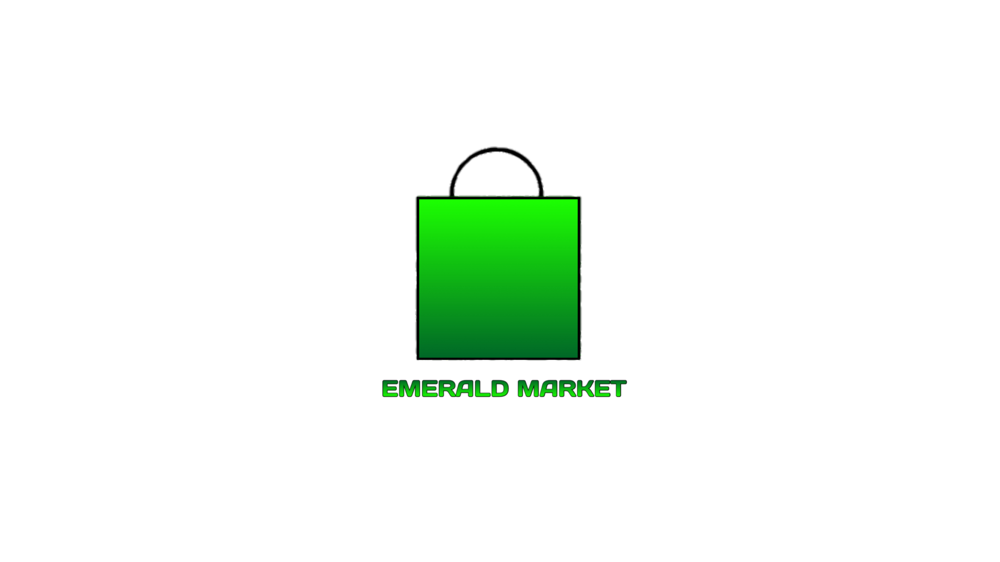

Welcome to Emerald Market!
---------------------------

Emerald Market is an Appstore and market place made for windows that
hosts all games and applications related to 427Games and 427emerald!
Hopefully somewhere down the line, more creators and contributors will
be able to publish their content to Emerald Market!

Emerald Market takes a little inspiration from Nintendo's own Appstore,
the Nintendo eShop. With this in mind, you'll be able to hear some
amazing music while you're shopping! If you use Emerald Market during
the holidays, you'll hear some holiday themed music as well!

Emerald Market is owned by 427emerald, as well as everything music related.
Please do not try to pass off this application as your own. There will be consequences.

Emerald Market requires an internet connection to use. If you do not have a stable internet
connection, Emerald Market will not work. Ethernet works with Emerald Market.

Emerald Market only needs to be downloaded from the internet once! After that, if there is
a new update for Emerald Market, it will be sent out through Emerald Market's Updater application,
provided in the files when Emerald Market is first downloaded. Use the Updater application to check

and download new versions of Emerald Market!

