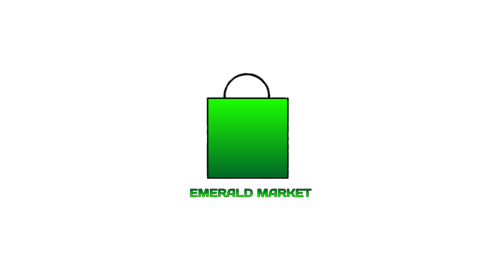

Welcome to Emerald Market!
---------------------------

Emerald Market is an Appstore and market place made for windows that
hosts all games and applications related to 427Games and 427emerald!
Hopefully somewhere down the line, more creators and contributors will
be able to publish their content to Emerald Market!

Emerald Market takes a little inspiration from Nintendo's own Appstore,
the Nintendo eShop. With this in mind, you'll be able to hear some
amazing music while you're shopping! If you use Emerald Market during
the holidays, you'll hear some holiday themed music as well!

Emerald Market is owned by 427emerald, as well as everything music related.
Please do not try to pass off this application as your own. There will be consequences.

Emerald Market requires an internet connection to use. If you do not have a stable internet
connection, Emerald Market will not work. Ethernet works with Emerald Market.

Emerald Market only needs to be downloaded from the internet once! After that, if there is
a new update for Emerald Market, it will be sent out through Emerald Market's Updater application,
provided in the files when Emerald Market is first downloaded. Use the Updater application to check
and download new versions of Emerald Market!

**Error Codes: What they mean and possible solutions!**
__________________________________________

Inside of Emerald Market, you may encounter some errors depending on what happens. This is a list of all the possible Error codes so you can trouble shoot them here!

**Error Code: 219**

Error Message: *Emerald Market could not establish a connection to the server. Please try again or check your internet connection*

What this means: Upon opening Emerald Market, it will normally try to check for any available updates before letting you shop. This error will usually show if there is a slow connection and it takes too long to check for an update within a certain amount of time, or if there is something preventing Emerald Market from checking for updates. The fix to this would be to use a better internet connection. If it’s something wrong with the servers, I’ll fix the issue myself.

**Error Code: 557**

Error Message: *This version of Emerald Market is out of date. In order to continue using this service, please update to the latest version.*

What this means: This message will only show if Emerald Market is out of date and there’s an update available to download. If you receive this message after updating, then something is wrong with Emerald Market’s internal files and I would need to fix the issue myself.

**Error Code: 676**

Error Message: *An error occurred while trying to connect to the internet. Please check your internet settings and make sure everything is correct.*

What this means: This message is self-explanatory. Emerald Market relies on internet to function, so if there is no internet connection, this error will show up.

**Error Code: 772**

Error Message: *The uninstall process failed. The software you are attempting to uninstall is either broken or missing. You can redownload the software from the software’s store page.*

What this means: This error will show when a user attempts to uninstall software from Emerald Market, and Emerald Market can’t uninstall it either due to missing files or permissions preventing deletion. If the user manually deleted the game themselves from their PC files, this message will show and can safely be ignored.

